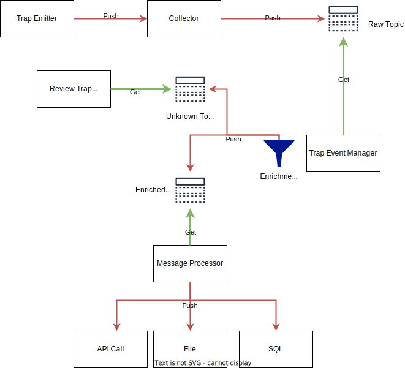

# snmptrap2mb

This project was designed to collect, filter and enrich snmp traps and transform them in another format.

## Actual implementation
This software bundle accept snmp v1 trap.
Snmp v2c and v3 are not yet tested / implemented as I'm focused on core functions. 

As the program was designed in the idea to run it in container or multiple machines to absorb
a huge amount of trap, a Load Balancer is recommended in front of it.

## Modules details 

### Collect trap
The snmpd collector works actually with snmp v1.
V2 and V3 is not yet implemented or validated.

Once the trap is received, it's stored in a kafka topic to be handled by another process.
There is no data manipulation during this process.

### Trap Event management
The Trap Event manager is collecting message from the topic and process the data content.
The processing is based on OID Filter with specifics actions that will discard the event or enrich it.
In case of discard action, the event is destroyed, in other case it will be published to another topic.
If it does not match an OID Filter, it will be pushed to a garbage collector that should be reviewed manually.

### Message processor
This process is designed to collect from the enriched topic the message and publish it to a 3rd party software
by different methods (API Call, File, SQL ...).
Actually this software part is not yet implemented.

### Review  Trap Process
This process allow to review events that were discarded because they didn't match any filter.
This "garbage collector" allow to ensure that no events could have been lost.
Actually this software part is not yet implemented.

## Configuration

### Global
Create a copy of config.sample.json to config.json in the same directory of the program.

 - ip : ip to listen to
 - port : port to listen to
 - threads : how many thread the program will use in order to absorb the load
 - log_level : which level of log do you want in the log output
 - log_output : by default stdout, if you define a file as a value it will output to this file.

 - kafka
   - raw, enriched, unknown
     - server : server and port to use to send or consume messages
     - topic : kafka topic to use to send or consume messages
     - group : group defined in kafka in order to ensure correct message consumption.

 - v3_users is not yet used, but will be for snmp v3 implementation with user authentication

### Trap Event Management

In the data folder, two folders are used to store the filters and enrichment.

#### How Filtering works
The filtering process is based on a json file with the name related to the oid received.

If the snmptrap is related to OID 1.3.6.1.4.1.8072.2.3.0.1, the filter rule will be
stored inside 1.3.6.1.4.1.8072.2.3.0.1.json file.

It's based on two major sections **default** and **conditions**.

##### default
This section cover default values applied to related trap.

It's done with 
 - global default values via Keys/Values items in ***values*** subsection.
 - specific values via a lookup performed on json file via a key.

lookup explanation:

    "enrichment":{
        "file": "sample.json",
        "key": "${Address}_INFO"
    }
This will use the sample.json file to define default value to the trap record if we find
the related key based on "${Address}_INFO".

**${Address}** format is important (Like Bash variable). It will be substituted by Address
value from the snmptrap datas.
So if we receive a trap from 192.168.0.80 the software will search for the key 192.168.0.80_INFO.

If we have the following data in the sample.json file

    {
        "192.168.0.80_INFO": {
        "Location": "OFFICE1",
        "Criticality": "1"
        }
    }

The trap data will be enriched with Location and Criticality values.

##### conditions
This section list conditions that will filter defined trap in order to discard them or to have specific actions.

Beware that filtering are like firewall rules, if it match it will not process others rules.
So ensure yourself that filters order is correctly done.

Considering the following example :

    {
      "UseCase": "UC001",
      "type" : "regexp",
      "action" : "enrich",
      "search": {
        "Address": "192\\.168.*",
        "specific-trap": "44"
      },
      "new_values": {
          "Security" : 1,
          "EventType" : 3,
          "Importance" : 2,
          "Technology" : "Test System",
          "Customer" : "HOME",
          "CustomerCode" : "007",
          "SLALevel" : 2,
          "Summary" : "$6",
          "Location" : "Unknown"
      },
      "enrichment": {
        "file": "sample.json",
        "key": "${Address}"
      }
    }

We have the following Keys/Values :
 - UseCase: to have a reference for a use case (ideally a reference that could be used in a wiki, KB or a manual)
 - type : type of conditions, actually only regexp is supported.
 - action: what action is perform, enrich or discard
 - search : list of values that must match in order to new values / lookup
 - new_values : list of new values to associate to the event data like in default section
   - a value starting by a $ symbol is a reference to the Xth value in the trap data.
 - enrichment : file to use as a dictionary and key to lookup inside to associate new values like in defaults section.

