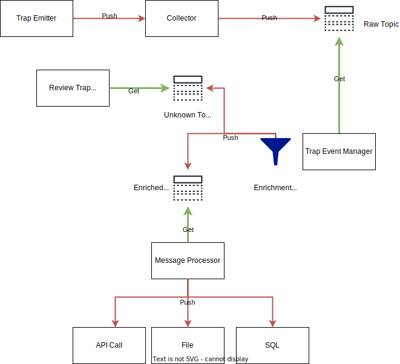

# snmptrap2mb

This project was designed to collect, filter and enrich snmptrap and then transform them in another format.

## Collect trap
The snmpd collector works actually with snmpv1.
V2 and V3 should work but not yet validated.

Once the trap is received, it's stored in a kafka topic to be handled by another process.
There is no data manipulation during this process.

## Trap Event management
The Trap Event manager is collecting message from the topic and process the data content.
The processing is based on OID Filter with specifics actions that will discard the event or enrich it.
In case of discard action, the event is destroyed, in other case it will be published to another topic.
If it does not match an OID Filter, it will be pushed to a garbage collector that should be reviewed manually.

## Message processor
This process is designed to collect from the enriched topic the message and publish it to a 3rd party software
by different methods (API Call, File, SQL ...).

